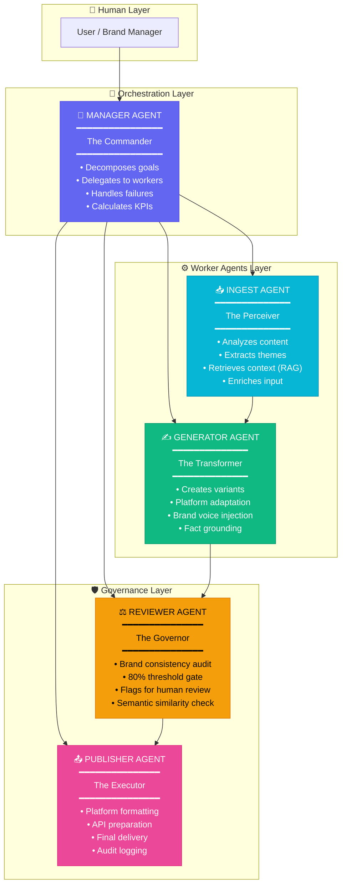

# SACO — Systemic AI Content Orchestrator
## Complete Workflow & Multi-Agent Architecture Documentation

<div align="center">

```
╔══════════════════════════════════════════════════════════════════════════════╗
║                    S A C O   —   SYSTEMIC AI ORCHESTRATION                   ║
║                                                                              ║
║        "Not a single powerful AI doing everything —                          ║
║         but a coordinated TEAM of specialized AI agents,                     ║
║         each mastering their own domain, working as one system."             ║
╚══════════════════════════════════════════════════════════════════════════════╝
```

</div>

---

## 📌 The Core Philosophy: Why Systemic AI?

### The Problem with "One AI Does It All"

Traditional AI content tools follow a **cosmetic approach**:
- Single LLM prompt → Single output
- No memory, no context, no brand awareness
- Every request starts from scratch ("amnesia problem")
- No quality gates, no governance, no audit trail

### The SACO Difference: **Systemic AI Architecture**

SACO implements a **hierarchical Multi-Agent System (MAS)** where:

| Traditional AI | SACO Systemic AI |
|----------------|------------------|
| One prompt, one response | Orchestrated pipeline of specialized agents |
| Generic output | Platform-optimized, brand-consistent variants |
| No memory | Vector-embedded knowledge base (RAG) |
| No governance | 80% brand consistency threshold + human review gates |
| Black box | Full audit trail with step-by-step logging |

```
┌─────────────────────────────────────────────────────────────────────────────┐
│                        THE SACO DESIGN PRINCIPLE                            │
│                                                                             │
│   "Humans define the GOAL and set the GUARDRAILS.                           │
│    The AI system figures out the HOW, executes autonomously,                │
│    and flags exceptions for human review."                                  │
│                                                                             │
│   → 80-90% autonomous execution (HOTL: Human-on-the-Loop)                   │  
│   → 10-20% human intervention for edge cases                                │
└─────────────────────────────────────────────────────────────────────────────┘
```

---

## 🤖 The AI Team: Agent Roles & Responsibilities

SACO operates with **5 specialized AI agents**, each with distinct responsibilities. This is NOT a single AI model — it's a coordinated team where each agent has expertise in a specific domain.

### Agent Hierarchy Overview



---

## 🎯 Agent Deep Dive: The Complete Team

### 1️⃣ THE MANAGER AGENT — *"The Commander"*

**Role Classification:** `Orchestrator` (not just Executor)  
**Trigger:** System Goal (not just user input)  
**Autonomy Level:** High (proactive, goal-driven)

```
┌───────────────────────────────────────────────────────────────────┐
│                    MANAGER AGENT RESPONSIBILITIES                 │
├───────────────────────────────────────────────────────────────────┤
│                                                                   │
│  🎯 GOAL DECOMPOSITION                                            │
│     Takes high-level user goals ("Transform this for social")    │
│     and breaks them into executable steps for worker agents      │
│                                                                   │
│  📋 WORKFLOW PLANNING                                             │
│     Creates a structured JSON plan with:                         │
│     • Sequential agent tasks                                     │
│     • Success criteria                                           │
│     • Fallback strategies for failures                           │
│                                                                   │
│  🔄 ITERATIVE EXECUTION                                           │
│     • Delegates tasks to appropriate worker agents               │
│     • Monitors execution results                                 │
│     • Retries or escalates on failures                           │
│                                                                   │
│  📊 KPI CALCULATION                                              │
│     Tracks and reports:                                           │
│     • Hit Rate (variants passing review)                          │
│     • Automation Rate (% without human intervention)              │
│     • Average Consistency Score                                   │
│     • Processing Time                                             │
│                                                                   │
│  🔔 EXCEPTION FLAGGING (HOTL)                                     │
│     Flags edge cases requiring human review, ensuring:            │
│     • 80-90% autonomous operation                                 │
│     • Human oversight for critical decisions                      │
│                                                                   │
└───────────────────────────────────────────────────────────────────┘
```

**Manager's Planning Output Example:**
```json
{
  "goal": "Transform 'AI Analytics Launch' for multi-platform distribution",
  "steps": [
    { "agent": "ingest", "action": "analyze", "params": {} },
    { "agent": "generator", "action": "generate", "params": { "platforms": ["twitter", "linkedin", "email"] } },
    { "agent": "reviewer", "action": "review", "params": {} },
    { "agent": "publisher", "action": "format", "params": {} }
  ],
  "successCriteria": "All variants score >= 80% brand consistency",
  "fallbackStrategy": "Regenerate failed variants with more context"
}
```

---

### 2️⃣ THE INGEST AGENT — *"The Perceiver"*

**Role Classification:** `Analyzer` + `Retriever`  
**Trigger:** Receives raw content from Manager  
**Special Capability:** RAG (Retrieval-Augmented Generation)

```
┌───────────────────────────────────────────────────────────────────┐
│                    INGEST AGENT RESPONSIBILITIES                  │
├───────────────────────────────────────────────────────────────────┤
│                                                                   │
│  🔍 CONTENT ANALYSIS                                              │
│     Extracts structured metadata from raw content:               │
│     • 3-5 Main themes                                            │
│     • 5-10 SEO-relevant keywords                                 │
│     • Sentiment (positive/negative/neutral)                      │
│     • Target audience inference                                  │
│     • 2-3 Key messages                                           │
│                                                                   │
│  🧠 EMBEDDING & STORAGE                                           │
│     • Generates vector embeddings of content                     │
│     • Stores in Pinecone vector database                         │
│     • Creates searchable semantic index                          │
│                                                                   │
│  📚 CONTEXT RETRIEVAL (RAG)                                       │
│     Queries vector DB for:                                       │
│     • Similar past content (avoid repetition)                    │
│     • Brand guidelines and voice                                 │
│     • Historical context for consistency                         │
│                                                                   │
│  ✨ CONTENT ENRICHMENT                                            │
│     Creates enriched payload for downstream agents with:         │
│     • Original content                                           │
│     • Extracted analysis                                         │
│     • Retrieved context                                          │
│     • Brand guidelines                                           │
│                                                                   │
│  🔗 CHEKHOV'S GUN TRACKING                                        │
│     Every piece of information ingested WILL be used:            │
│     • No dangling details                                        │
│     • Complete information flow to generators                    │
│                                                                   │
└───────────────────────────────────────────────────────────────────┘
```

**The "Amnesia" Problem SOLVED:**
```
BEFORE (Stateless AI):
├── Request 1: "Write about AI" → Generic AI content
├── Request 2: "Write about AI" → Different generic content (no memory)
└── Request 3: "Write about AI" → Yet another version (inconsistent)

AFTER (SACO with RAG):
├── Request 1: "Write about AI" → Analyzes, embeds, stores in vector DB
├── Request 2: "Write about AI" → Retrieves previous context, builds upon it
└── Request 3: "Write about AI" → Consistent with brand + prior content
```

---

### 3️⃣ THE GENERATOR AGENT — *"The Transformer"*

**Role Classification:** `Creator` + `Adapter`  
**Trigger:** Receives enriched content from Ingest Agent  
**Core Principle:** COPE — Create Once, Publish Everywhere

```
┌───────────────────────────────────────────────────────────────────┐
│                   GENERATOR AGENT RESPONSIBILITIES                │
├───────────────────────────────────────────────────────────────────┤
│                                                                   │
│  🔄 PLATFORM-SPECIFIC TRANSFORMATION                              │
│     Adapts content to each platform's constraints:               │
│                                                                   │
│     ┌─────────────┬────────────┬─────────────────────────────┐   │
│     │ Platform    │ Max Chars  │ Style                       │   │
│     ├─────────────┼────────────┼─────────────────────────────┤   │
│     │ Twitter     │ 280        │ Punchy, hashtags, threads   │   │
│     │ LinkedIn    │ 3,000      │ Professional, thought-lead  │   │
│     │ Email       │ 5,000      │ Newsletter, scannable       │   │
│     │ Instagram   │ 2,200      │ Emotional, storytelling     │   │
│     │ Blog        │ 10,000     │ SEO-optimized, H2/H3        │   │
│     └─────────────┴────────────┴─────────────────────────────┘   │
│                                                                   │
│  🎨 BRAND VOICE INJECTION                                         │
│     • Applies brand DNA guidelines                               │
│     • Maintains tone consistency across platforms                │
│     • Uses required keywords, avoids prohibited ones             │
│                                                                   │
│  🔒 FACT GROUNDING                                                │
│     Critical anti-hallucination measure:                         │
│     • ONLY uses information from enriched input                  │
│     • Does NOT invent facts                                      │
│     • Every claim traceable to source                            │
│                                                                   │
│  📝 OUTPUT GENERATION                                             │
│     For each platform, produces:                                 │
│     • Main content (within char limits)                          │
│     • Hashtags (where applicable)                                │
│     • Hook/Subject line                                          │
│     • Character count                                            │
│                                                                   │
└───────────────────────────────────────────────────────────────────┘
```

**COPE in Action:**
```
                    ┌─────────────────────┐
                    │   ORIGINAL CONTENT  │
                    │   "AI Analytics     │
                    │    Launch Article"  │
                    │     (2000 words)    │
                    └──────────┬──────────┘
                               │
                    ┌──────────▼──────────┐
                    │   GENERATOR AGENT   │
                    └──────────┬──────────┘
                               │
       ┌───────────────────────┼───────────────────────┐
       │                       │                       │
       ▼                       ▼                       ▼
┌─────────────┐         ┌─────────────┐         ┌─────────────┐
│   TWITTER   │         │  LINKEDIN   │         │    EMAIL    │
│   Variant   │         │   Variant   │         │   Variant   │
├─────────────┤         ├─────────────┤         ├─────────────┤
│ 280 chars   │         │ 1200 chars  │         │ 800 chars   │
│ 3 hashtags  │         │ Professional│         │ Subject line│
│ Punchy hook │         │ Hook + CTA  │         │ Sections    │
└─────────────┘         └─────────────┘         └─────────────┘
```

---

### 4️⃣ THE REVIEWER AGENT — *"The Governor"*

**Role Classification:** `Auditor` + `Quality Gate`  
**Trigger:** Receives generated variants from Generator  
**Core Function:** Brand Consistency Enforcement

```
┌───────────────────────────────────────────────────────────────────┐
│                   REVIEWER AGENT RESPONSIBILITIES                 │
├───────────────────────────────────────────────────────────────────┤
│                                                                   │
│  ⚖️ BRAND CONSISTENCY SCORING                                     │
│     Evaluates each variant against 5 criteria:                   │
│                                                                   │
│     ┌────────────────────┬─────────┬──────────────────────────┐  │
│     │ Criterion          │ Weight  │ What's Measured          │  │
│     ├────────────────────┼─────────┼──────────────────────────┤  │
│     │ Tone Match         │   30%   │ Alignment with brand     │  │
│     │                    │         │ voice                    │  │
│     │ Value Alignment    │   25%   │ Brand values reflected   │  │
│     │ Keyword Usage      │   15%   │ Required keywords        │  │
│     │                    │         │ present                  │  │
│     │ Avoid Words Check  │   15%   │ Prohibited words         │  │
│     │                    │         │ absent                   │  │
│     │ Audience Fit       │   15%   │ Appropriate for target   │  │
│     └────────────────────┴─────────┴──────────────────────────┘  │
│                                                                   │
│  🚦 THRESHOLD GATE                                                │
│     • Threshold: 80% weighted score                              │
│     • PASS → Approved for publishing                             │
│     • FAIL → Flagged for human review or regeneration            │
│                                                                   │
│  🧮 SEMANTIC SIMILARITY FALLBACK                                  │
│     If LLM scoring fails:                                        │
│     • Uses cosine similarity on embeddings                       │
│     • Compares content vector vs. brand DNA vector               │
│     • Converts similarity (0-1) to percentage score              │
│                                                                   │
│  📝 FEEDBACK GENERATION                                           │
│     For failed variants, provides:                               │
│     • Specific feedback on what went wrong                       │
│     • Actionable improvement suggestions                         │
│                                                                   │
└───────────────────────────────────────────────────────────────────┘
```

**The 80% Threshold Gate:**
```
                    VARIANT ARRIVES
                          │
                          ▼
              ┌───────────────────────┐
              │   REVIEWER SCORES     │
              │   Brand Consistency   │
              └───────────┬───────────┘
                          │
                   Score Calculated
                          │
            ┌─────────────┴─────────────┐
            │                           │
      Score >= 80%                Score < 80%
            │                           │
            ▼                           ▼
    ┌───────────────┐           ┌───────────────┐
    │   ✅ PASSED   │           │   ❌ FLAGGED  │
    │   → Publisher │           │   → Human     │
    │     Agent     │           │     Review    │
    └───────────────┘           │   OR          │
                                │   → Regenerate│
                                └───────────────┘
```

---

### 5️⃣ THE PUBLISHER AGENT — *"The Executor"*

**Role Classification:** `Formatter` + `Deliverer`  
**Trigger:** Receives approved variants from Reviewer  
**Core Capability:** Platform API Formatting

```
┌───────────────────────────────────────────────────────────────────┐
│                   PUBLISHER AGENT RESPONSIBILITIES                │
├───────────────────────────────────────────────────────────────────┤
│                                                                   │
│  🔧 PLATFORM-SPECIFIC FORMATTING                                  │
│     Final formatting touches for each platform:                  │
│                                                                   │
│     TWITTER:                                                     │
│     • Thread format (1/n) if needed                              │
│     • Hashtag placement optimization                             │
│     • Character count validation                                 │
│                                                                   │
│     LINKEDIN:                                                    │
│     • Professional hook enhancement                              │
│     • Visibility settings (PUBLIC)                               │
│     • Engagement CTA placement                                   │
│                                                                   │
│     EMAIL:                                                       │
│     • Subject line extraction                                    │
│     • HTML body generation                                       │
│     • Plain text fallback                                        │
│     • Preview text                                               │
│                                                                   │
│     INSTAGRAM:                                                   │
│     • Caption with line breaks                                   │
│     • Hashtag block at end                                       │
│     • Emoji optimization                                         │
│                                                                   │
│     BLOG:                                                        │
│     • SEO metadata (title, description, keywords)                │
│     • HTML structure (H1, H2, H3)                                │
│     • Markdown alternative                                       │
│                                                                   │
│  📡 API PREPARATION                                               │
│     Creates platform-ready payloads with:                        │
│     • Exact API field formats                                    │
│     • Required metadata                                          │
│     • Authentication headers (production)                        │
│                                                                   │
│  📋 AUDIT LOGGING                                                 │
│     Records for every publish action:                            │
│     • Timestamp                                                  │
│     • Platform                                                   │
│     • Content hash                                               │
│     • Mock/Live status                                           │
│                                                                   │
└───────────────────────────────────────────────────────────────────┘
```

---

## 🔄 The Complete Workflow: Step-by-Step

### End-to-End Content Transformation Pipeline

```
┌─────────────────────────────────────────────────────────────────────────────────────────┐
│                              SACO COMPLETE WORKFLOW                                      │
└─────────────────────────────────────────────────────────────────────────────────────────┘

STEP 1: USER INPUT
━━━━━━━━━━━━━━━━━━━━━━━━━━━━━━━━━━━━━━━━━━━━━━━━━━━━━━━━━━━━━━━━━━━━━━━━━━━━━━━━━━━━━━━━
│ User uploads content (article, blog, announcement)
│ Selects target platforms (Twitter, LinkedIn, Email, etc.)
│ Brand DNA already configured in system
└──────────────────────────────────────────────────────────────────────────────────────────
                                         │
                                         ▼
STEP 2: MANAGER PLANNING
━━━━━━━━━━━━━━━━━━━━━━━━━━━━━━━━━━━━━━━━━━━━━━━━━━━━━━━━━━━━━━━━━━━━━━━━━━━━━━━━━━━━━━━━
│ 🎯 Manager Agent receives the goal
│ → Decomposes into executable steps
│ → Creates workflow plan with success criteria
│ → Defines fallback strategies
│                                                              
│ OUTPUT: JSON Execution Plan
└──────────────────────────────────────────────────────────────────────────────────────────
                                         │
                                         ▼
STEP 3: CONTENT INGESTION & ENRICHMENT
━━━━━━━━━━━━━━━━━━━━━━━━━━━━━━━━━━━━━━━━━━━━━━━━━━━━━━━━━━━━━━━━━━━━━━━━━━━━━━━━━━━━━━━━
│ 📥 Ingest Agent processes raw content
│                                                              
│ → Extracts themes: ["AI", "Analytics", "Product Launch"]
│ → Extracts keywords: ["machine learning", "data intelligence", ...]
│ → Determines sentiment: "positive"
│ → Identifies audience: "Tech-savvy business leaders"
│ → Summarizes key messages
│                                                              
│ → EMBEDS content in Pinecone vector DB
│ → RETRIEVES similar past content (RAG)
│ → RETRIEVES brand guidelines from vector DB
│                                                              
│ → ENRICHES content with all context
│                                                              
│ OUTPUT: Enriched Content Payload
└──────────────────────────────────────────────────────────────────────────────────────────
                                         │
                                         ▼
STEP 4: MULTI-PLATFORM GENERATION
━━━━━━━━━━━━━━━━━━━━━━━━━━━━━━━━━━━━━━━━━━━━━━━━━━━━━━━━━━━━━━━━━━━━━━━━━━━━━━━━━━━━━━━━
│ ✍️ Generator Agent creates platform variants
│                                                              
│ FOR EACH PLATFORM:
│ ┌─────────────────────────────────────────────────────────┐
│ │ Twitter (280 chars)                                     │
│ │ "🚀 Big news! Our AI-powered analytics platform is     │
│ │ here. Real-time insights. Natural language queries.    │
│ │ No complexity. Start your free trial → #AI #Analytics" │
│ └─────────────────────────────────────────────────────────┘
│ ┌─────────────────────────────────────────────────────────┐
│ │ LinkedIn (3000 chars)                                   │
│ │ "We've been working on something special for the       │
│ │ past year...                                           │
│ │                                                         │
│ │ Today, I'm thrilled to announce the launch of our      │
│ │ AI-powered analytics platform that transforms how      │
│ │ businesses understand their data.                       │
│ │ [...]"                                                  │
│ └─────────────────────────────────────────────────────────┘
│ ┌─────────────────────────────────────────────────────────┐
│ │ Email Newsletter                                        │
│ │ Subject: The Future of Data Intelligence is Here       │
│ │ Body: Dear [Name], We're excited to share...           │
│ └─────────────────────────────────────────────────────────┘
│                                                              
│ OUTPUT: Array of Platform Variants
└──────────────────────────────────────────────────────────────────────────────────────────
                                         │
                                         ▼
STEP 5: BRAND CONSISTENCY REVIEW
━━━━━━━━━━━━━━━━━━━━━━━━━━━━━━━━━━━━━━━━━━━━━━━━━━━━━━━━━━━━━━━━━━━━━━━━━━━━━━━━━━━━━━━━
│ ⚖️ Reviewer Agent audits each variant
│                                                              
│ FOR EACH VARIANT:
│ ┌─────────────────────────────────────────────────────────┐
│ │ Variant: Twitter                                        │
│ │ ─────────────────────────────────────────────────────── │
│ │ Tone Match:        88/100  (30%)                        │
│ │ Value Alignment:   85/100  (25%)                        │
│ │ Keyword Usage:     90/100  (15%)                        │
│ │ Avoid Words Check: 100/100 (15%)                        │
│ │ Audience Fit:      82/100  (15%)                        │
│ │ ─────────────────────────────────────────────────────── │
│ │ OVERALL SCORE: 87.9%                                    │
│ │ STATUS: ✅ PASSED (threshold: 80%)                      │
│ └─────────────────────────────────────────────────────────┘
│                                                              
│ IF SCORE < 80%:
│ → Flag for human review OR
│ → Request regeneration with enhanced brand context
│                                                              
│ OUTPUT: Reviewed Variants with Scores & Status
└──────────────────────────────────────────────────────────────────────────────────────────
                                         │
                                         ▼
STEP 6: FINAL FORMATTING & PUBLISHING
━━━━━━━━━━━━━━━━━━━━━━━━━━━━━━━━━━━━━━━━━━━━━━━━━━━━━━━━━━━━━━━━━━━━━━━━━━━━━━━━━━━━━━━━
│ 📤 Publisher Agent formats approved variants
│                                                              
│ → Applies platform-specific final touches
│ → Generates API-ready payloads
│ → Creates HTML versions for email
│ → Optimizes hashtag placement
│                                                              
│ → Logs all actions for audit trail
│ → Mock publishes (production: actual API calls)
│                                                              
│ OUTPUT: Formatted, Publish-Ready Content
└──────────────────────────────────────────────────────────────────────────────────────────
                                         │
                                         ▼
STEP 7: KPI REPORTING
━━━━━━━━━━━━━━━━━━━━━━━━━━━━━━━━━━━━━━━━━━━━━━━━━━━━━━━━━━━━━━━━━━━━━━━━━━━━━━━━━━━━━━━━
│ 📊 Manager Agent calculates final metrics
│                                                              
│ ┌─────────────────────────────────────────────────────────┐
│ │          ORCHESTRATION COMPLETE                         │
│ │ ═══════════════════════════════════════════════════════ │
│ │ Hit Rate:           87%  (target: 85%)           ✅     │
│ │ Automation Rate:    100% (no human intervention) ✅     │
│ │ Avg Consistency:    89%  (target: 80%)           ✅     │
│ │ Processing Time:    12s  (target: <30s)          ✅     │
│ └─────────────────────────────────────────────────────────┘
│                                                              
│ OUTPUT: Final Results + Full Audit Log
└──────────────────────────────────────────────────────────────────────────────────────────
```

---

## 📊 Key Performance Indicators (KPIs)

SACO tracks these metrics to measure system effectiveness:

| KPI | Description | Target | How It's Measured |
|-----|-------------|--------|-------------------|
| **Hit Rate** | % of variants passing 80% brand consistency | 85% | `(passed_variants / total_variants) × 100` |
| **Automation Rate** | % processed without human intervention | 90% | `(auto_approved / total_processed) × 100` |
| **Consistency Score** | Average brand alignment across all variants | 80%+ | Mean of all Reviewer scores |
| **Processing Time** | End-to-end orchestration duration | <30s | Time from start to completion |

---

## 🛡️ Governance & Human-on-the-Loop (HOTL)

### The HOTL Principle

SACO implements **Human-on-the-Loop** governance, not Human-in-the-Loop:

```
┌─────────────────────────────────────────────────────────────────────────┐
│                    HUMAN-ON-THE-LOOP (HOTL) MODEL                       │
├─────────────────────────────────────────────────────────────────────────┤
│                                                                         │
│  ❌ Human-in-the-Loop (Traditional):                                    │
│     Human approves EVERY action                                         │
│     → Slow, bottlenecked, defeats automation purpose                    │
│                                                                         │
│  ✅ Human-on-the-Loop (SACO):                                           │
│     AI operates autonomously within defined guardrails                  │
│     Human only intervenes for EXCEPTIONS                                │
│     → 80-90% fully autonomous                                           │
│     → 10-20% flagged for human review                                   │
│                                                                         │
└─────────────────────────────────────────────────────────────────────────┘
```

### When Human Review is Required

```
┌───────────────────────────────────────────────────────┐
│            AUTOMATIC HUMAN REVIEW TRIGGERS            │
├───────────────────────────────────────────────────────┤
│                                                       │
│ 🚩 Brand Consistency < 80%                            │
│    Variant doesn't align with brand guidelines        │
│                                                       │
│ 🚩 Sensitive Topic Detection                          │
│    Content touches on regulated/sensitive subjects    │
│                                                       │
│ 🚩 Legal/Compliance Flags                             │
│    Potential trademark, copyright, or legal issues    │
│                                                       │
│ 🚩 Novel Content Type                                 │
│    First time processing a new content category       │
│                                                       │
│ 🚩 High-Stakes Platform                               │
│    Press releases, investor communications, etc.      │
│                                                       │
└───────────────────────────────────────────────────────┘
```

---

## 🧠 Memory & Context: The RAG System

### How SACO Solves the "Amnesia Problem"

Traditional AI systems are **stateless** — each request starts fresh with no memory of past interactions, brand guidelines, or content history. SACO implements **Retrieval-Augmented Generation (RAG)** to provide persistent, semantic memory.

```
┌─────────────────────────────────────────────────────────────────────────────────────┐
│                              RAG ARCHITECTURE                                        │
├─────────────────────────────────────────────────────────────────────────────────────┤
│                                                                                     │
│   INGESTION (Write Path)                                                            │
│   ─────────────────────────────────────────────────                                 │
│   Content → Embedding Model → Vector → Pinecone DB                                  │
│                                                                                     │
│   ┌────────────┐    ┌────────────────┐    ┌──────────────┐    ┌──────────────┐     │
│   │  Content   │ →  │ OpenAI Embed   │ →  │ 1536-dim     │ →  │  Pinecone    │     │
│   │  + Brand   │    │ text-embed-3   │    │ Vector       │    │  Vector DB   │     │
│   │  DNA       │    │ -small         │    │              │    │              │     │
│   └────────────┘    └────────────────┘    └──────────────┘    └──────────────┘     │
│                                                                                     │
│   RETRIEVAL (Read Path)                                                             │
│   ─────────────────────────────────────────────────                                 │
│   Query → Embedding → Similarity Search → Top-K Results → Context                   │
│                                                                                     │
│   ┌────────────┐    ┌────────────────┐    ┌──────────────┐    ┌──────────────┐     │
│   │  "Write    │ →  │  Embed Query   │ →  │  Cosine      │ →  │  Top 3       │     │
│   │   about    │    │                │    │  Similarity  │    │  Relevant    │     │
│   │   AI..."   │    │                │    │  Search      │    │  Docs        │     │
│   └────────────┘    └────────────────┘    └──────────────┘    └──────────────┘     │
│                                                                                     │
└─────────────────────────────────────────────────────────────────────────────────────┘
```

### What Gets Stored in Vector DB

| Content Type | Purpose | When Stored |
|--------------|---------|-------------|
| **Brand DNA** | Voice, tone, values, keywords | When user configures brand settings |
| **Past Content** | Consistency, no repetition | After each content processing |
| **Templates** | Style references | Pre-loaded or user-created |
| **Feedback** | Learning from corrections | When human corrects AI output |

---

## 🔮 Future Roadmap: Expanding the AI Team

### Planned Additional Agents

```
┌─────────────────────────────────────────────────────────────────────────┐
│                       FUTURE AGENT EXPANSIONS                           │
├─────────────────────────────────────────────────────────────────────────┤
│                                                                         │
│ 🖼️ IMAGE GENERATOR AGENT                                               │
│    • Stable Diffusion / DALL-E integration                              │
│    • Brand-consistent visual asset creation                             │
│    • Automatic image sizing per platform                                │
│                                                                         │
│ 🎬 VIDEO AGENT                                                          │
│    • Clips generation from text                                         │
│    • NeRF / Gaussian Splatting for 3D content                           │
│    • Auto-subtitling and formatting                                     │
│                                                                         │
│ 📈 ANALYTICS AGENT                                                      │
│    • Post-publish performance tracking                                  │
│    • A/B variant comparison                                             │
│    • Feedback loop to improve future generation                         │
│                                                                         │
│ 🌐 LOCALIZATION AGENT                                                   │
│    • Multi-language translation                                         │
│    • Cultural adaptation                                                │
│    • Regional compliance checking                                       │
│                                                                         │
│ ⚖️ LEGAL COMPLIANCE AGENT                                               │
│    • Trademark verification                                             │
│    • Copyright check                                                    │
│    • Regulatory compliance (GDPR, etc.)                                 │
│                                                                         │
└─────────────────────────────────────────────────────────────────────────┘
```

---

## 📚 Technical Implementation Summary

| Component | Technology | Purpose |
|-----------|------------|---------|
| **LLM Engine** | Groq (Llama 3.3 70B) | Fast inference for all agents |
| **Vector Database** | Pinecone | Semantic search & memory |
| **Embeddings** | OpenAI text-embedding-3-small | 1536-dim vector representations |
| **Orchestration** | LangChain | Agent chaining & prompt management |
| **Backend** | Node.js + Express | API & agent hosting |
| **Frontend** | React | Dashboard & content management |
| **Database** | MongoDB Atlas | User data, content, brand DNA |

---

## 📝 Summary

**SACO is not just another AI content tool — it's a complete operating system for content transformation.**

```
┌─────────────────────────────────────────────────────────────────────────────────────┐
│                                                                                     │
│  ✅ SYSTEMIC, NOT COSMETIC                                                          │
│     A coordinated team of specialized AI agents, not a single monolithic model      │
│                                                                                     │
│  ✅ HIERARCHICAL MAS                                                                │
│     Manager orchestrates, Workers execute, Reviewer governs, Publisher delivers     │
│                                                                                     │
│  ✅ MEMORY-ENABLED (RAG)                                                            │
│     Vector database provides persistent brand knowledge and content context         │
│                                                                                     │
│  ✅ QUALITY GATED                                                                   │
│     80% brand consistency threshold with automatic flagging for human review        │
│                                                                                     │
│  ✅ FULLY AUDITABLE                                                                 │
│     Complete step-by-step logging of every agent action                             │
│                                                                                     │
│  ✅ COPE PRINCIPLE                                                                  │
│     Create Once, Publish Everywhere — one input, multiple platform-optimized outputs│
│                                                                                     │
└─────────────────────────────────────────────────────────────────────────────────────┘
```

---

<div align="center">

**SACO** — *From Cosmetic AI to Systemic Intelligence*

*Transforming content workflows, one agent at a time.*

---

**Built for AI Bharat AWS Hackathon 2026**

</div>
